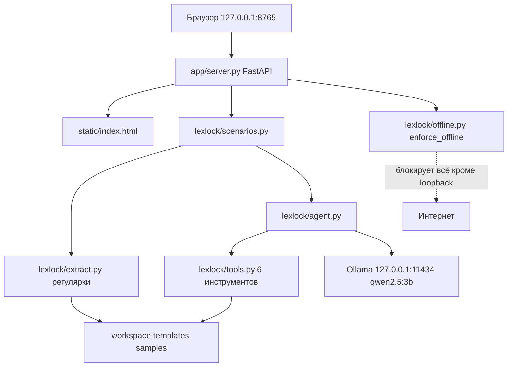

# AGENTS.md — как устроен проект и как его улучшать

> Файл для ИИ-агентов и людей-контрибьюторов. Прочитал за 5 минут — понял, что это,
> как работает и куда можно вмешиваться. Архитектурный контракт живёт в `SPEC.md`.

## Что это

«ЛексЛок» — локальный офлайн ИИ-агент для юриста. Устанавливается на обычный ноутбук,
работает без интернета, обрабатывает документы под NDA и персональные данные, не
отправляя их наружу. Демо для акселератора 2026. Подробнее об идее — `docs/00 Обзор идеи.md`.

## Принципы установки (UX) — обязательны для всех агентов

Главный пользователь — **юрист, а не программист**. Установка не должна требовать
терминала, знания флагов и чтения логов.

1. **Один клик.** Пользователь скачивает один файл (`.dmg` / `.AppImage` / `.exe`),
   открывает его и запускает. Никаких `./install.sh`, `pip`, `uv`, `ollama pull` руками.
2. **Никакого чёрного терминала с простыней логов.** Прогресс — понятными словами
   (нативные диалоги/окна), ошибки — человеческим языком с кнопкой «показать журнал».
3. **Понятный первый экран.** Что это и что сейчас произойдёт; после установки —
   само открывает браузер на `http://127.0.0.1:8765`.
4. **Предсказуемость для 8 ГБ ОЗУ.** Модель подбирается автоматически (`check_ram.py
   --recommend`), тяжёлые зависимости не тянем (инвариант 4).
5. **Честность про интернет.** Первый запуск качает Ollama и модель (~2 ГБ). Это нужно
   писать прямо в окне установки, а не в docs.
6. **Идемпотентность.** Повторный запуск установщика/лаунчера не ломает уже
   установленное и не качает заново.

Проверка «сделано хорошо»: человек без опыта, получив только файл, ставит и запускает
приложение, ни разу не открыв терминал.

## Быстрый старт

```bash
uv venv --python 3.12 .venv
uv pip install --python .venv/bin/python -e ".[dev]"
ollama pull qwen2.5:3b
.venv/bin/python -m pytest tests -q
./run.sh
```

Ожидаемо: тесты зелёные (на заглушках, без Ollama), затем сервер отвечает на
`http://127.0.0.1:8765`. Отсутствие Ollama не ломает приложение: детерминированные
сценарии работают, LLM-сценарии честно деградируют. Полная установка одной командой —
`./install.sh` (флаг `--skip-model` пропускает скачивание модели).

Для конечного пользователя есть установка одной строкой без git:
`curl -fsSL .../bootstrap.sh | bash` — качает проект, ставит `uv`, Ollama и модель.
`install.sh` теперь сам подтягивает `uv` (официальный скрипт) и Ollama (macOS:
Homebrew или Ollama.app; Linux: официальный скрипт), а не требует их заранее.

## Карта репозитория

| Путь | Назначение |
|---|---|
| `lexlock/` | Ядро: LLM-клиент, инструменты, агентский цикл, сценарии, извлечение реквизитов |
| `app/` | Веб-слой: FastAPI (`server.py`) и одна локальная страница (`static/index.html`) |
| `scripts/` | Проверка ресурсов, генератор шаблона договора, тестовые данные |
| `templates/` | Шаблон `dogovor_template.docx` с плейсхолдерами `{{ключ}}` |
| `samples/` | Тестовый пакет: паспорт, реквизиты организации, договор с рисками |
| `tests/` | 103 теста, Ollama не требуется |
| `docs/` | Пояснительные заметки (копия из Obsidian, источник истины в хранилище) |
| `packaging/` | Сборка установщиков: `.dmg`, AppImage, Inno Setup (Windows) |
| `.github/workflows/` | CI (тесты) и Release (сборка установщиков по тегу `v*`) |
| `SPEC.md` | Замороженный контракт интерфейсов. Менять только осознанно |

Модули ядра:

| Файл | Что делает |
|---|---|
| `lexlock/config.py` | `Config` и `load_config()` — env-настройки, пути |
| `lexlock/offline.py` | `enforce_offline()` — запрет сокетов вне loopback |
| `lexlock/llm.py` | Клиент Ollama: `chat`, `stream`, `json_chat`, `health` |
| `lexlock/docs.py` | Чтение txt/md/docx/pdf, заполнение docx по `{{ключ}}` |
| `lexlock/extract.py` | `FIELDS`, `extract_requisites()` — только регулярки, без LLM |
| `lexlock/rag.py` | Подбор релевантных абзацев под запрос (RAG-lite, стемминг корней) |
| `lexlock/cache.py` | Дисковый кэш ответов LLM (`.lexlock_cache`, env `LEXLOCK_CACHE=0` отключает) |
| `lexlock/ocr.py` | Локальный OCR (Tesseract, `rus`); сканы PDF через PyMuPDF |
| `lexlock/checklists.py` | Чек-листы договоров по типам, автоопределение типа |
| `lexlock/tools.py` | 6 инструментов агента, `tool_schemas()`, `dispatch()` |
| `lexlock/agent.py` | Цикл агента: `chat` → tool calls → наблюдения → ответ |
| `lexlock/scenarios.py` | Три сценария: `fill_contract`, `find_risks`, `ask` |
| `lexlock/prompts.py` | Русские системные промпты |

## Архитектура в 10 строках

Браузер открывает локальную страницу. FastAPI принимает файлы в рабочую папку.
Сценарий читает документы, детерминированная часть извлекает реквизиты регулярками,
LLM-часть идёт в Ollama на `127.0.0.1:11434`. Агентный чат сам решает, какой из
шести инструментов вызвать. Наружу не уходит ни один запрос.



## Инварианты, которые нельзя ломать

1. **Ни одного запроса вне loopback.** `enforce_offline()` патчит `socket` и активен по
   умолчанию. Это главное обещание продукта, а не деталь реализации.
2. **Детерминированные сценарии работают без LLM.** Извлечение реквизитов и заполнение
   договора не должны зависеть от модели. Иначе демо на слабой машине развалится.
3. **Тесты не требуют Ollama.** LLM всегда замокана. Тест, которому нужен живой Ollama,
   сломает CI и чужую машину.
4. **Никаких тяжёлых зависимостей.** Без torch, transformers, numpy. Суммарный вес
   зависимостей держим до 150 МБ: продукт ставится на 8 ГБ ОЗУ.
5. **Модель по умолчанию `qwen2.5:3b`**, переключается через `LEXLOCK_MODEL`.
6. **Интерфейсы из `SPEC.md` §2 заморожены.** Меняешь сигнатуру — правь SPEC.md в том же
   коммите, иначе параллельные агенты и фронтенд разъедутся.
7. **Фронтенд без CDN и внешних шрифтов.** Любая внешняя ссылка ломает офлайн и
   проваливает `test_server.py`.

## Как добавить новый инструмент агента

1. Написать функцию в `lexlock/tools.py`, которая принимает простые аргументы и возвращает
   словарь. Исключения она бросать не должна.
2. Описать `Tool(name, description, parameters, fn)`: `description` по-русски (его читает
   модель), `parameters` это JSON Schema.
3. Добавить `Tool` в список `TOOLS`.
4. Покрыть тестами в `tests/test_tools.py`, включая путь с ошибкой.
5. Если инструмент нужен и в UI: добавить сценарий в `lexlock/scenarios.py`, endpoint в
   `app/server.py` и карточку в `app/static/index.html`.

Скелет:

```python
def _count_words(filename: str) -> dict:
    text = docs.read_document(load_config().workspace / filename)
    return {"words": len(text.split())}

Tool(
    name="count_words",
    description="Посчитать число слов в документе.",
    parameters={
        "type": "object",
        "properties": {"filename": {"type": "string"}},
        "required": ["filename"],
    },
    fn=_count_words,
)
```

## Как добавить новый сценарий

1. Функция в `lexlock/scenarios.py` с фиксированной сигнатурой, возвращает словарь с
   ключом `ok` и русским `error` при неудаче.
2. `POST /api/scenario/<имя>` в `app/server.py`, валидация имени файла через
   `safe_workspace_path`.
3. Карточка в `app/static/index.html` (описание, кнопка, рендер результата).
4. Тесты: юнит на сценарий и тест endpoint с замоканным сценарием.

## Где что менять при смене модели

| Что | Где |
|---|---|
| Имя модели | переменная `LEXLOCK_MODEL`, значение по умолчанию в `lexlock/config.py` |
| Оценка требуемой ОЗУ | `scripts/check_ram.py`, словарь `MODEL_RAM_GB` |
| Документация | `docs/02 Модель и железо.md` |
| Лицензия | если модель не Apache 2.0, это вопрос к юристу, а не к коду |

## Тесты и проверка

```bash
.venv/bin/python -m pytest tests -q                          # всё, без Ollama
.venv/bin/python -m pytest tests/test_extract.py tests/test_docs.py \
    tests/test_tools.py tests/test_agent.py -q                # только ядро
```

Признаки готовности: все тесты зелёные, `/api/health` отвечает, `fill_contract` в
пакетном режиме извлекает 23 поля из `samples/`.

Живой прогон с моделью (нужна запущенная Ollama):

```bash
LEXLOCK_WORKSPACE=$(mktemp -d) cp samples/* "$LEXLOCK_WORKSPACE" && \
LEXLOCK_WORKSPACE="$LEXLOCK_WORKSPACE" .venv/bin/python -c \
"from lexlock import scenarios; print(scenarios.fill_contract()); print(scenarios.ask('01_pasospiska.txt','кто заказчик?') if False else '')"
```

## Известные ограничения и грабли

- Модель 3B слабее облачной. Это осознанный обмен качества на приватность.
- Поиск рисков на CPU занимает около 50 секунд. Вопрос по документу — около 12 секунд.
- Контекст ограничен `config.max_ctx_chars` (12000 символов). Длинные договоры режутся.
- Режим «весь пакет» читает все документы рабочей папки, включая ранее сгенерированные
  `.docx`. Безвредно, но может слегка засорить извлечение.
- `qwen2.5:3b` идёт под **Qwen Research License** (не Apache 2.0). Для коммерческого
  использования нужна юридическая проверка. У `qwen2.5:1.5b` лицензия Apache 2.0.
- `ollama serve` не является частью приложения: `run.sh` поднимает его при необходимости,
  но при ручном запуске `python -m app.server` Ollama надо поднять отдельно.

### Грабли, на которые уже наступали (не повторять)

- **Нет Xcode — нет `git`/`python3`.** На чистой macOS `/usr/bin/git` и `/usr/bin/python3`
  лишь вызывают диалог установки Command Line Tools. Обошли: `uv` подтягивает Python,
  а `git` поставили через micromamba (`~/.local/git`), не требуя Xcode.
- **Ollama сама не появляется.** Первая версия `install.sh` только предупреждала об
  отсутствии Ollama — пользователь оставался без модели. Теперь скрипт ставит её сам
  (macOS: Homebrew или `Ollama.app`; Linux: офиц. скрипт).
- **`check_ram.py` падал на macOS**: читал `/proc/meminfo`, которого на Mac нет. Нужны
  `sysctl hw.memsize` + `vm_stat` + `vm.swapusage`.
- **Tesseract не читает из `/tmp`** на macOS (TCC): `fopenReadStream` не находит файл.
  Держите временные файлы в `$TMPDIR`/домашнем каталоге, не в `/tmp`.
- **Tesseract пишет не-UTF8 в stderr** — `subprocess(text=True)` падает. Декодировать
  stdout/stderr с `errors="replace"`.
- **`secrets` нельзя использовать в `if:` GitHub Actions** — workflow становится
  невалидным (0 jobs, «Invalid workflow file»). Секрет кладём в `env` job'а и проверяем
  `env.X != ''`.
- **`appimagetool`, скачанный в `dist/`, попадал в ассеты релиза** (glob `dist/*.AppImage`).
  Сборочные инструменты качать во временный каталог.
- **`git`-фильтр `on.push.tags` не спасает от невалидного workflow**: невалидный файл
  даёт «красный» запуск без шагов. Сначала локально проверяем YAML/синтаксис.
- **Токен в чате = утечка.** Пат-токены из переписки отзывать; для заливки без git
  использовали GitHub API (`~/.local/bin/lexlock_push.py`), токен держим в файле `600`.
- **Установщики «тонкие»**: первый запуск требует интернет (Ollama+модель). Полностью
  офлайн-установки пока нет — это осознанное ограничение, не баг.
- **Скрипты в `packaging/windows/` — это не корень проекта.** `.venv`, `pyproject.toml`,
  `.lexlock_model` лежат двумя уровнями выше. Раньше `install.ps1`/`run.vbs`/`run.bat`
  брали `..` и создавали venv внутри `packaging\windows`, после чего запуск падал с
  «модуль app не найден». Правильно — искать корень вверх до `pyproject.toml`.
- **Нельзя ставить `.venv` внутрь `.app`.** macOS запускает скачанное приложение из
  read-only каталога (Gatekeeper translocation), и установка молча падает. Правильно —
  разворачивать проект в `~/Library/Application Support/LexLock` (так делает лаунчер).
- **Gatekeeper блокирует неподписанный `.app`** (quarantine от браузера). Для пользователя
  это выглядит как «не открывается». Лечится правым кликом → «Открыть» (один раз) или
  подписью/нотаризацией. В `.dmg` кладём файл «Как открыть.txt».
- **TCC «App Management»** не даёт менять/удалять бандлы в `/Applications` без прав админа
  (`Operation not permitted`), даже если файл принадлежит пользователю. Не пытайтесь
  чинить установленное приложение в `/Applications` из скрипта — только Finder с подтверждением.

## Дорожная карта

Отсортировано по ценности:

1. ✅ RAG-lite: `rag.select_relevant()` подбирает релевантные абзацы под запрос
   вместо обрезки по длине (`find_risks`, `ask`). Полноценный индекс по нескольким
   документам — ещё нет.
2. ✅ LLM-fallback к регуляркам: ненайденные поля дозаполняет модель и они попадают
   в `model_fields` (флаг `LEXLOCK_LLM_EXTRACT`, по умолчанию в `run.sh` включён).
3. ✅ Кэш ответов по хешу модели/документа/вопроса (`cache.py`), повтор мгновенный.
4. ✅ Экспорт отчёта о рисках в `.docx` (`export_risks`, кнопка «Экспорт в Word»).
5. Чек-лист рисков по типам договоров вместо свободного рассуждения модели.
6. ✅ OCR для PDF-сканов и изображений: локальный Tesseract (`rus`), `ocr.py`,
   `pymupdf` extra; если OCR нет — приложение работает как раньше.
7. ✅ Визард модели: `check_ram.py --recommend` и авто-выбор в `install.sh`
   (`qwen2.5:1.5b` на слабой ОЗУ), выбор сохраняется в `.lexlock_model`.
8. Бенчмарк качества на русских юридических документах с фиксацией точности извлечения.
9. ✅ Установщики: `.dmg` (macOS), AppImage (Linux), Inno Setup (Windows), автосборка
   по тегу `v*` в `release.yml`. Полностью офлайн-установка (без первого скачивания) — нет.
10. ⏳ Подпись: шаги `codesign`/`notarytool` (macOS) и `signtool` (Windows) добавлены в
    `release.yml` и включаются при заданных секретах-сертификатах. Нужны сами сертификаты.
11. ✅ Чек-листы договоров по типам (`checklists.py`, endpoint, карточка в UI).

## Стиль кода

- Python 3.11+, типизация, датаклассы, без `Any` там где можно иначе.
- Пользовательские строки по-русски, короткие, без эмодзи в служебных сообщениях.
- Комментарии только там, где логика неочевидна (например, защита от path traversal).
- Не подавлять типы: никаких `# type: ignore` и `as any`-аналогов.

## Журнал изменений (для агентов и контрибьюторов)

Ведите здесь короткие записи: дата — что изменено, зачем, что проверено.
Формат одной строкой, без воды.

- 2026-10-03 — `install.sh`: автоустановка `uv` и Ollama (macOS: Homebrew/Ollama.app,
  Linux: официальный скрипт), понятные сообщения вместо жёсткого отказа. Проверено:
  `bash -n`, тесты 112/112.
- 2026-10-03 — `bootstrap.sh`: установка одной командой без git (скачивает tarball
  ветки, ставит проект в `$LEXLOCK_DIR`, пробрасывает флаги в `install.sh`).
- 2026-10-03 — `run.sh`: ищет Ollama в `Ollama.app`/Homebrew, сам открывает браузер,
  флаг `--no-browser`.
- 2026-10-03 — `scripts/check_ram.py`: поддержка macOS (`hw.memsize`, `vm_stat`,
  `vm.swapusage`) вместо падения на отсутствующем `/proc/meminfo`; скрипты сделаны
  исполняемыми, вызовы переведены на Python из venv.
- 2026-10-03 — сквозная проверка на чистой macOS (8 ГБ): `./install.sh` сам поставил
  Ollama в `~/Applications/Ollama.app`, скачал `qwen2.5:3b`, `EXIT=0`; модель ответила,
  `/api/health` вернул `ok:true, model_installed:true, offline:true`.
- 2026-10-03 — `lexlock/rag.py`: RAG-lite, подбор релевантных абзацев под запрос со
  стеммингом корней; подключён в `find_risks` и `ask` вместо обрезки по длине.
- 2026-10-03 — `lexlock/cache.py`: дисковый кэш успешных ответов LLM (ключ — модель +
  текст + вопрос), `LEXLOCK_CACHE=0` отключает. `find_risks`/`ask` теперь возвращают
  `cached: bool`.
- 2026-10-03 — `app/server.py`: лимит 25 МБ на загружаемый файл (413), запись только
  после проверки всех файлов.
- 2026-10-03 — `.github/workflows/ci.yml`: прогон тестов на push/PR (Python 3.12, uv).
- 2026-10-03 — тесты: +12 (rag, cache, кэш сценариев, лимит загрузки) → 124 зелёных.
- 2026-10-03 — `docs.write_risk_report` + `scenarios.export_risks` + endpoint
  `/api/scenario/export_risks` и кнопка «Экспорт в Word»: отчёт о рисках в `.docx`.
- 2026-10-03 — `check_ram.py --recommend` + `install.sh`: авто-выбор модели по ОЗУ
  (`qwen2.5:1.5b` на слабой машине), выбор пишется в `.lexlock_model` и читается `run.sh`.
- 2026-10-03 — `fill_contract`: дозаполнение ненайденных полей моделью при
  `LEXLOCK_LLM_EXTRACT=1` (в `run.sh` включено, в тестах выключено), поле `model_fields`.
- 2026-10-03 — `packaging/`: `.dmg` (macOS, проверен локально), AppImage (Linux),
  PowerShell + Inno Setup (Windows). Автосборка по тегу `v*` в `release.yml`.
- 2026-10-03 — тесты: +8 (export_risks, LLM-дозаполнение, recommend) → 132 зелёных.
- 2026-10-03 — `lexlock/ocr.py` + `docs.read_document`: локальный OCR Tesseract (`rus`)
  для изображений и PDF-сканов через PyMuPDF (extra `[ocr]`). `install.sh` ставит
  tesseract+русский (brew/apt) и extra `[ocr]`; флаг `--no-ocr` отключает.
  Живая проверка: скан PDF «Аренда помещения / Арендная плата 50 000 рублей» распознан.
- 2026-10-03 — `lexlock/checklists.py`: чек-листы договоров (услуги, поставка, аренда,
  подряд, заём, конфиденциальность), автоопределение типа; сценарий `check_contract`,
  endpoint `/api/scenario/checklist`, карточка «Чек-лист договора» в интерфейсе.
- 2026-10-03 — `release.yml`: условная подпись/нотаризация (Apple) и подпись Windows
  (signtool) при наличии секретов; без сертификатов собираются неподписанные файлы.
- 2026-10-03 — локально поставлен `git` 2.56 через micromamba (без Xcode), проект
  переведён на обычные коммиты; `~/.local/git/bin` добавлен в PATH.
- 2026-10-03 — тесты: +13 (ocr, checklists, endpoint) → 145 зелёных.
- 2026-10-03 — релиз `v0.1.0`: workflow `release.yml` собрал `.dmg`, `.AppImage`,
  Windows `.exe` (jobs macos/linux/windows/release — success) и опубликовал в Releases.
  Исправление: `secrets` нельзя использовать в `if` — перенесено в `env` job'а;
  `appimagetool` больше не попадает в ассеты (качается во временный каталог).
- 2026-10-03 — установщики сделаны «для людей»: macOS — настоящий `ЛексЛок.app` в `.dmg`
  с перетаскиванием в «Программы» и нативными диалогами; Linux AppImage — прогресс через
  zenity/kdialog и авто-открытие браузера; Windows — установка скрыта, запуск через
  `run.vbs` без консоли. Версия 0.2.0. Принципы и грабли — в разделах выше.
- 2026-10-03 — релиз `v0.2.0` собран и опубликован (macos/linux/windows/release —
  success): `LexLock-0.2.0.dmg`, `LexLock-0.2.0-x86_64.AppImage`, `LexLock-0.2.0-win-setup.exe`.
- 2026-10-03 — системный промт агента усилен: кто он, задача, жёсткое «отвечай только
  на русском»; добавлена страховка `needs_russian_retry` — если ответ на CJK без
  кириллицы, агент один раз переспрашивает по-русски. ASK/RISK-промты тоже требуют
  русский язык. Версия 0.2.2.
- 2026-10-09 — синхронизация с GitHub: локальная ветка приведена к `origin/main`
  (`08ccd73`, релиз 0.2.2); origin переведён на HTTPS (SSH к GitHub недоступен).
- 2026-10-09 — переименование «Ваня» → «ЛексЛок»: пакет `vanya/`→`lexlock/`,
  `VANYA_*`→`LEXLOCK_*`, `.vanya_model`→`.lexlock_model`, `.vanya_cache`→`.lexlock_cache`,
  артефакты `LexLock-*`, README/доки/установщики. Проверено: 147/147 тестов.
- 2026-10-09 — fix(windows): `install.ps1`, `run.vbs`, `run.bat` лежат в
  `packaging\windows`, но искали `.venv`/`pyproject.toml` рядом с собой. Теперь корень
  ищется вверх до `pyproject.toml`; venv, лог и `.lexlock_model` — в корне проекта;
  в PATH процесса добавляются каталоги Ollama. В `installer.iss` добавлен
  `InfoBeforeFile` с честным предупреждением про интернет при установке.
- 2026-10-09 — README переписан под актуал: убран раздел «Структура репозитория»,
  добавлены скриншот интерфейса и схема продукта (`docs/assets/`, `docs/08 Схема продукта.md`).
- 2026-10-09 — `bootstrap.sh`: слаг `workihi53-max/lexlock` с откатом на старое имя
  `vanya-legal-vault` и ветку `master` — установка не сломается до переименования репозитория.
- 2026-10-09 — репозиторий на GitHub переименован в `workihi53-max/lexlock`; добавлен
  `docs/09 Технические параметры для заявки.md` (техпараметры и соответствие направлению).

