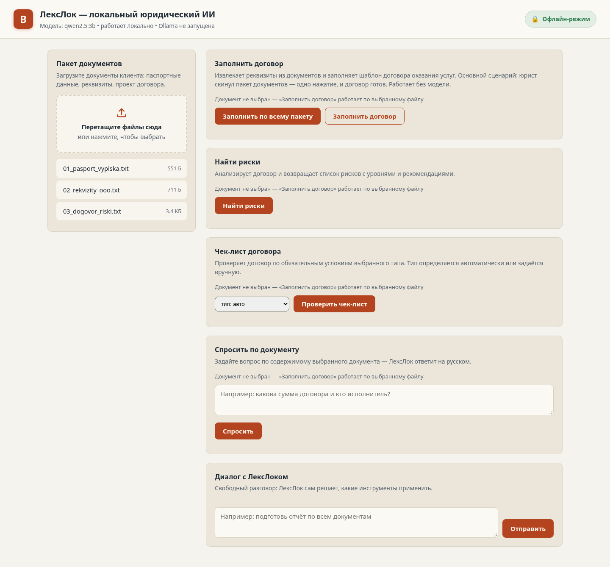
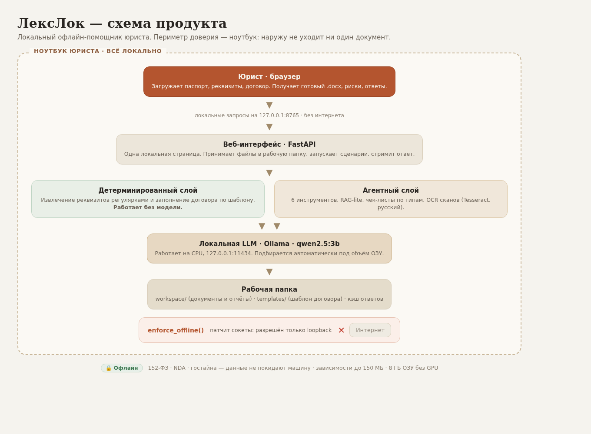

# ЛексЛок — локальный офлайн ИИ-помощник юриста

**ЛексЛок** — приложение для ноутбука юриста: локальная языковая модель и все
вычисления работают на самой машине, документы никуда не отправляются. Интернет нужен
только один раз — при установке, чтобы скачать модель. Дальше можно выключить сеть:
заполнение договоров, поиск рисков и ответы по документам продолжат работать.

Демо для акселератора 2026. Работает на обычном ноутбуке: 8 ГБ ОЗУ, без GPU.



## Зачем это нужно

Юридические документы часто нельзя отдавать во внешние сервисы:

- **152-ФЗ «О персональных данных»** — паспортные данные, ИНН, адреса.
- **NDA и коммерческая тайна** — договоры, реквизиты, суммы.
- **Политика безопасности и GDPR** — запрет на передачу данных третьим лицам.
- **Гостайна и служебная тайна** — работа вообще без внешних сервисов.

Облачные ИИ-ассистенты отправляют текст документов на чужие серверы — для юриста это
неприемлемо. ЛексЛок держит документы и модель рядом с пользователем: в строгом режиме
`LEXLOCK_OFFLINE=1` любые сетевые соединения вне `127.0.0.1` блокируются принудительно.

## Что умеет

1. **Заполнение договора** — загрузите паспорт и реквизиты, приложение извлечёт 23 поля
   и заполнит `templates/dogovor_template.docx`. Без модели, на регулярках.
2. **Поиск рисков** — анализ договора со списком рисков по уровням и рекомендациями;
   результат выгружается отчётом в `.docx`.
3. **Чек-лист договора** — проверка по обязательным условиям с процентом готовности
   (услуги, поставка, аренда, подряд, заём, конфиденциальность). Тип определяется сам.
4. **Вопрос по документу** — ответ по содержимому конкретного файла.
5. **Диалог с агентом** — модель сама решает, какой из шести инструментов применить.
6. **Сканы и фото** — локальный OCR на русском (Tesseract) для PDF-сканов и картинок.

Повторные запросы по тому же документу берутся из кэша — анализ рисков из ~40 секунд
превращается в мгновенный. Без установленной модели детерминированные сценарии
(реквизиты и заполнение договора) работают в полном объёме, LLM-сценарии честно
переходят на эвристику.

## Как устроено



Браузер открывает локальную страницу на `127.0.0.1:8765`. FastAPI принимает файлы в
рабочую папку. Детерминированная часть извлекает реквизиты регулярками и заполняет
шаблон; LLM-часть идёт в Ollama на `127.0.0.1:11434`. Агентный чат сам выбирает
инструмент. Наружу не уходит ни один запрос — это и есть продукт.

## Требования

| Ресурс | Минимум |
|---|---|
| ОЗУ | 8 ГБ |
| Свободное место | 6 ГБ (модель ~1–2 ГБ + окружение) |
| CPU | 4 ядра, GPU не нужен |
| Python | 3.12 (ставится автоматически вместе с `uv`) |
| Ollama | ставится автоматически скриптом установки |

## Установка в один клик

Готовые установщики — в разделе **Releases** на GitHub. Терминал не нужен:

- **macOS** — `LexLock-<версия>.dmg`: открыть, перетащить «ЛексЛок» в «Программы», запустить.
- **Linux** — `LexLock-<версия>-x86_64.AppImage`: сделать исполняемым и открыть двойным кликом.
- **Windows** — `LexLock-<версия>-win-setup.exe`: обычный установщик с ярлыками.

Приложение само откроет браузер. Первый запуск скачает Ollama и модель (~2 ГБ), дальше
работает офлайн. Кнопка «Установить компоненты» в меню «Пуск» повторяет установку на Windows.

## Установка одной командой (для разработки)

Установка сама подтягивает `uv`, Ollama и модель — готовить ничего заранее не нужно:

```bash
curl -fsSL https://raw.githubusercontent.com/workihi53-max/lexlock/main/bootstrap.sh | bash
```

Скрипт скачает проект в `~/lexlock`, поставит окружение, Ollama и модель `qwen2.5:3b`,
затем нужно запустить:

```bash
cd ~/lexlock
./run.sh                # запуск: офлайн, браузер откроется сам
# http://127.0.0.1:8765
```

Если репозиторий уже скачан, достаточно двух команд в его папке:

```bash
./install.sh
./run.sh
```

Без скачивания модели (быстрая проверка детерминированных сценариев):

```bash
./install.sh --skip-model
./run.sh
```

Нужен только `curl` и один раз интернет. Если Ollama ставилась впервые, на macOS один
раз запустите приложение Ollama — затем `./run.sh` поднимет её сам.

## Как доказать, что приложение офлайн

1. `./run.sh` — по умолчанию `LEXLOCK_OFFLINE=1`.
2. Отключите сеть (Wi-Fi / кабель) — приложение продолжает работать.
3. Любое соединение, кроме `127.0.0.1`, вернёт ошибку.

Для отладки без жёсткого офлайн-режима: `./run.sh --no-offline`.

## Переменные окружения

| Переменная | По умолчанию | Назначение |
|---|---|---|
| `LEXLOCK_MODEL` | подбирается по ОЗУ | модель Ollama |
| `LEXLOCK_OLLAMA_URL` | `http://127.0.0.1:11434` | адрес Ollama |
| `LEXLOCK_WORKSPACE` | `<проект>/workspace` | папка с документами |
| `LEXLOCK_PORT` | `8765` | порт веб-приложения |
| `LEXLOCK_OFFLINE` | `1` | жёсткий офлайн (блок не-loopback) |
| `LEXLOCK_CACHE` | `1` | кэш ответов LLM (`0` — отключить) |
| `LEXLOCK_LLM_EXTRACT` | `1` в `run.sh` | дозаполнение реквизитов моделью |

## Ограничения честно

- **Первый запуск требует интернет** — скачиваются Ollama и модель. Полностью
  офлайн-установочного файла пока нет.
- Модель `qwen2.5:3b` слабее облачных. Это осознанный обмен качества на приватность.
- На CPU поиск рисков занимает десятки секунд, длинные договоры обрабатываются медленно.
- Это демо, а не законченный продукт: результаты не заменяют проверку юристом.
- `qwen2.5:3b` идёт под Qwen Research License (не Apache 2.0). Для коммерческого
  использования нужна юридическая проверка; у `qwen2.5:1.5b` лицензия Apache 2.0.
- Тестовые документы в `samples/` содержат вымышленные данные.

## Для разработчиков

```bash
uv venv --python 3.12 .venv
uv pip install --python .venv/bin/python -e ".[dev]"
.venv/bin/python -m pytest tests -q     # тесты не требуют Ollama
./run.sh
```

Архитектурный контракт интерфейсов — `SPEC.md`, карта модулей и правила — `AGENTS.md`.
