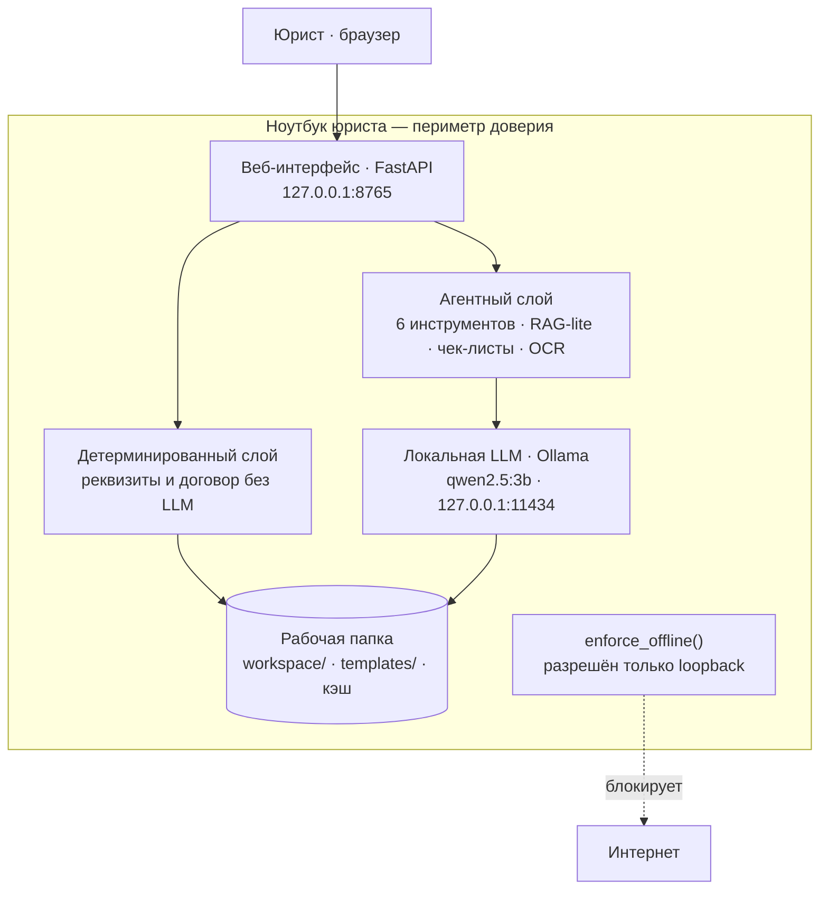

# Схема продукта

Схема показывает главное: **периметр доверия — это ноутбук юриста**. Всё, что видит
пользователь и что делает расчёты, находится внутри одного компьютера. Наружу
не уходит ни один документ.

## Поток данных

1. **Юрист · браузер** — загружает паспорт, реквизиты, договор и получает результат:
   заполненный `.docx`, список рисков, ответ по документу.
2. **Веб-интерфейс (FastAPI)** — одна локальная страница на `127.0.0.1:8765`.
   Принимает файлы в рабочую папку, запускает сценарии, стримит ответ агента.
3. **Детерминированный слой** — извлечение реквизитов регулярками и заполнение договора
   по шаблону. **Работает без языковой модели** — на слабой машине демо не развалится.
4. **Агентный слой** — шесть инструментов, RAG-lite, чек-листы по типам договоров,
   OCR сканов (Tesseract, русский).
5. **Локальная LLM** — Ollama с моделью `qwen2.5:3b` на `127.0.0.1:11434`. Модель
   подбирается автоматически под объём ОЗУ.
6. **Рабочая папка** — `workspace/` (документы и отчёты), `templates/` (шаблон договора),
   кэш ответов.

## Офлайн-граница

Функция `enforce_offline()` патчит сетевые вызовы на уровне процесса: разрешены только
`127.0.0.1`, `localhost` и `::1`. Любая попытка выйти в интернет поднимает ошибку.
Это главное обещание продукта, а не деталь реализации.

## Почему это конкурентоспособно

- **Приватность как архитектура.** Данные физически некуда отправить — сеть отрезана
  на уровне процесса, а не «по политике».
- **Работает на 8 ГБ ОЗУ без GPU.** Зависимости держим до 150 МБ, без torch и numpy.
- **Детерминированное ядро.** Реквизиты и заполнение договора не зависят от модели —
  результат воспроизводим, а демо не ломается на слабой машине.
- **Понятная установка.** Один файл и клик, без терминала и флагов.

Связанные заметки: [[01 Архитектура]], [[02 Модель и железо]], [[05 Топ-функции и отличия]].
